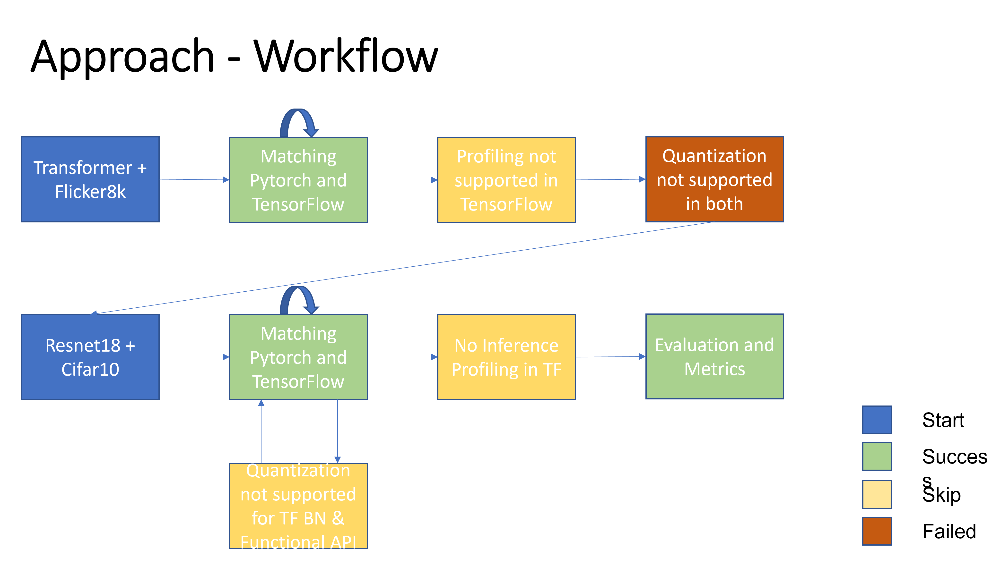
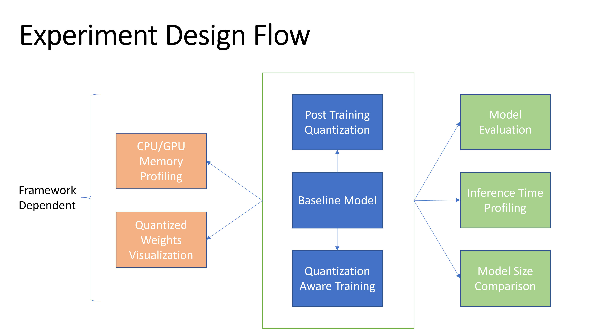
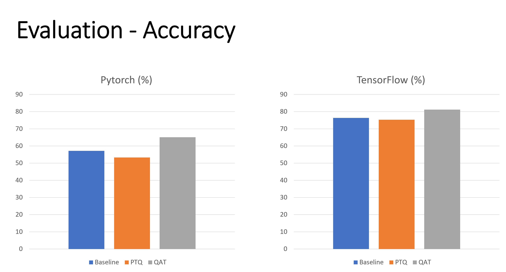
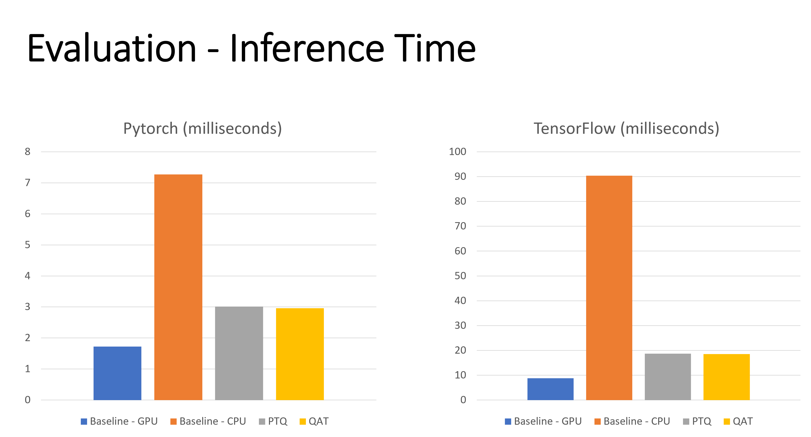
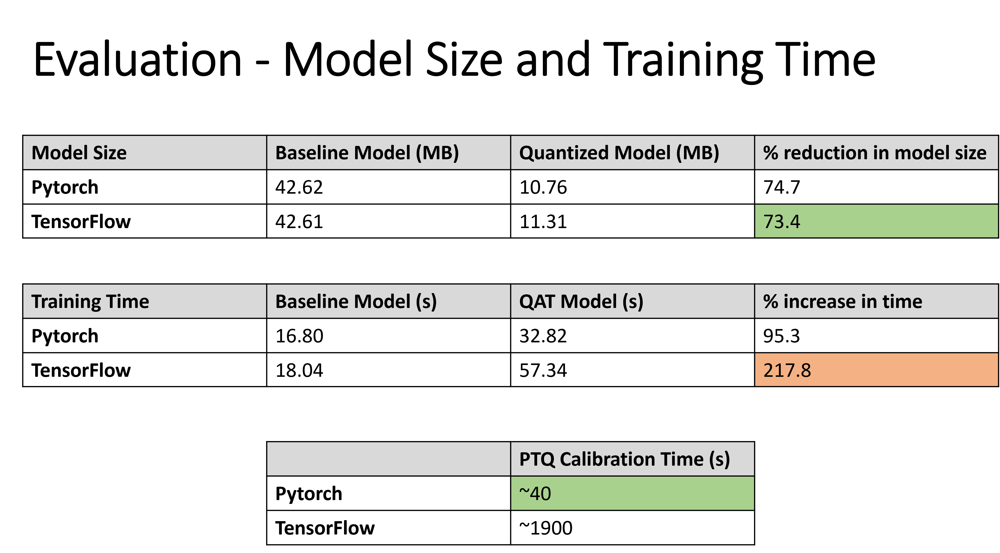

# Pytorch_vs_Tensorflow
Abhi Lad al4363 - High Performance Machine Learning Project
# Project Description
Though Pytorch and TensorFlow are tremendous ML libraries with extensive support, if Github threads and Stackoverflow are any metrics, a lot of functionalities are still missing.
Especially in case of current trends of extremely large models, we need to identify and optimize model performance by reducing memory and time consumption.
Quantization is a simple and proven method, and in this project we aim to find the support and implementation gaps for this feature in both the libraries.

Since we were aiming for one-to-one comparison between TensorFlow and Pytorch, we had exponential increase in model iterations due to different implementation paradigms.
The following diagrams show the overall workflow of our project.

Workflow

Experiments

# Code Structure
All codes are in jupyter notebooks and do not need any special commands to run.
Final Code:
* Pytorch Implementation : [notebook](Profile_pt_clf.ipynb)
* TensorFlow Implementation : [notebook](Profile_tf_clf.ipynb)

Failed and Scrapped Code:
* Pytorch Implementation : [notebook](Failed_Pytorch_image_captioning.ipynb)
* TensorFlow Implementation : [notebook](Failed_Tensorflow_image_captioning.ipynb)

# Results
Accuracy

Infernce Time

Model Size and Training Time

The compiled list of issues uncovered.

| Functionality    | Pytorch                                                                                                                                                         | Tensorflow                                                                                                                                                                                                         |
|------------------|-----------------------------------------------------------------------------------------------------------------------------------------------------------------|--------------------------------------------------------------------------------------------------------------------------------------------------------------------------------------------------------------------|
| Hardware Support | - No general TPU support - No quantization support on GPU                                                                                                       | - Convoluted implementation for GPU/TPU                                                                                                                                                                            |
| Profiler         |                                                                                                                                                                 | - Profiler has conflict with TF model layers - No profiler support for inference                                                                                                                                   |
| Quantization     | - Manual layer fusion expected - Manual quantization agent setup - Only supported on CPU - Automated quantization in beta - Embedding type layers not supported | - Requires special layer annotation for   unsupported layers (no documentation) - Auto quanitzation requires special interpreter - QAT has significant overhead (3x Pytorch) - Embedding type layers not supported |
| Analysis         | - Quantization stubs do not allow    further probing                                                                                                            | - TF lite models are byte type, thus    preventing access to model layers                                                                                                                                          |
